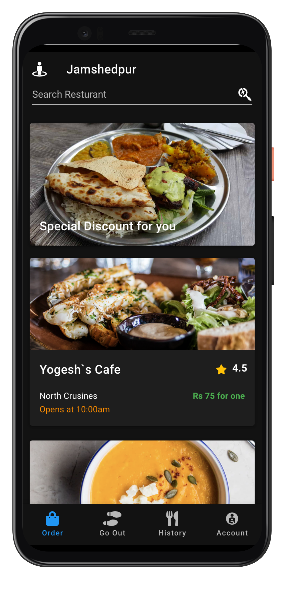

# Eats

## Getting Started
The "Eats" Food Delivery application is a stunning UI/UX design created using the `Vue.js` framework and the `Vuetify` component library. Developed based on a real-life scenario, this application offers a delightful and intuitive user experience for ordering food online.<br>

With its clean and modern design, the "Eats" application provides users with a visually appealing interface that is easy to navigate. The thoughtful arrangement of elements, intuitive icons, and well-organized layout contribute to an effortless and enjoyable user journey.

Overall, the "Eats" Food Delivery application exemplifies the power of Vue.js and Vuetify in crafting beautiful and user-friendly interfaces. Its real-life scenario-based design, combined with the smooth navigation and interactive components, offers an exceptional user experience for online food ordering.

**🚀🚀 Hosted at Github Pages [here](https://shreyans13.github.io/Eats/#/).**

## Some Features
- Progressive Web App (PWA) supported.
- Search among resturants.
- A responsive and mobile friendly design.
- Bottom navigation bar for fast navigation.
- Native app like UI.

### Show some :heart: and :star: the repo to support the project. 

## Screenshots

### Mobile
  
  
  
 

### Desktop
 
 


## 👍 Contribution
1. Fork it
2. Create your feature branch (git checkout -b my-new-feature)
3. Commit your changes (git commit -m 'Add some feature')
4. Push to the branch (git push origin my-new-feature)
5. Create new Pull Request

### What can you contribute
1. Create a api for this application using ExpressJS or Django or any other framework
2. Find bugs or errors and fix it.
3. Improve UI/UX designs.
4. Add some cool features.

## Project setup
```
yarn install
```

### Compiles and hot-reloads for development
```
yarn serve
```

### Compiles and minifies for production
```
yarn build
```

### Lints and fixes files
```
yarn lint
```

### Customize configuration
See [Configuration Reference](https://cli.vuejs.org/config/).


### Implementation :innocent:

This project is implemented in Vue.js, Vuetify, VueRouter, Vuex and PWA.


## Facing Any Problem or need any Help:grey_question:
Incase you face any problem or need any help write me in [issues](https://github.com/Shreyans13/Eats/issues) section. 


